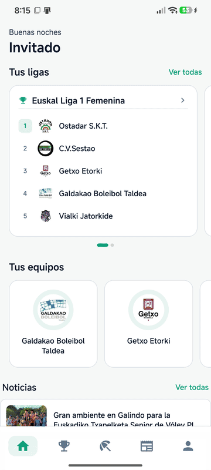
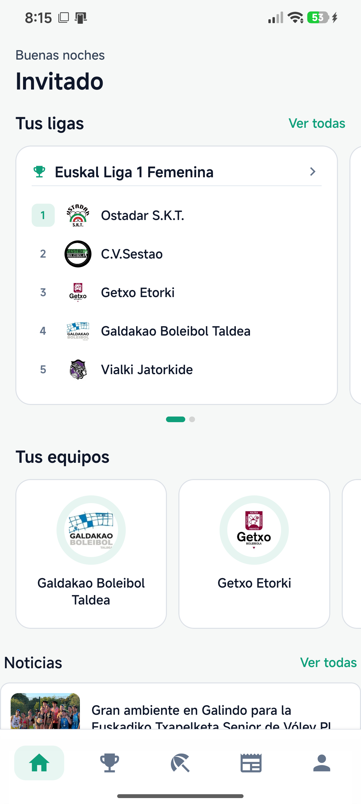
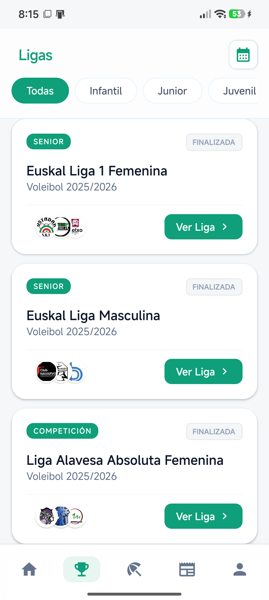
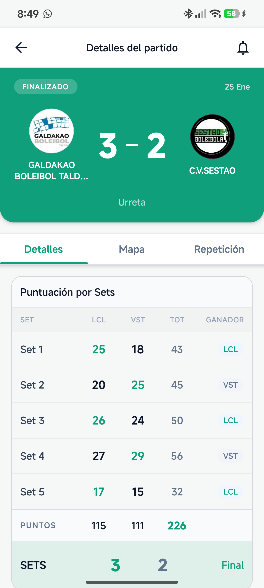
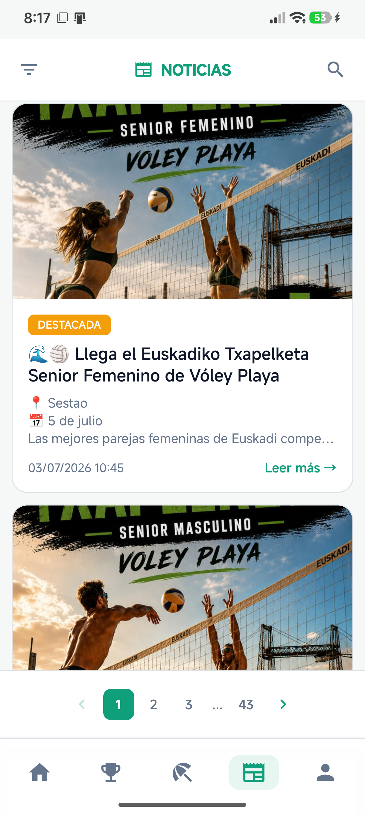
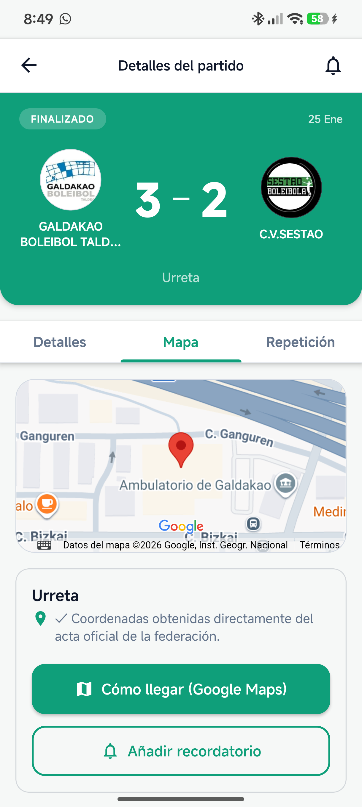
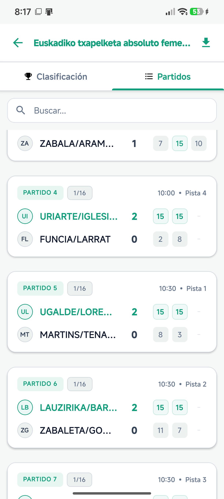
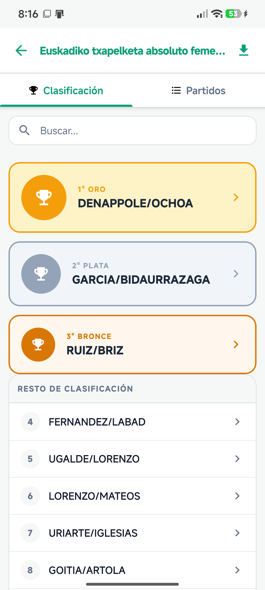

<div align="center">
  
  <h1>Voleibol Vizcaya</h1>
  <p><strong>All Bizkaia volleyball, in one app.</strong><br />Competitions, results, standings, news and beach volleyball.</p>

  <p>
    <a href="README.md">Español</a> · <a href="README.eu.md">Euskara</a>
  </p>

  <h2 align="center">A quick look at the app</h2>

  <p align="center">
    
  </p>

  <p align="center"><sub>The carousel changes screens automatically every two seconds.</sub></p>

  <p>
    
    
    
    
    
    
  </p>
</div>

> **Important notice:** Voleibol Vizcaya is **not an official application** of any federation. It retrieves information through scraping of public sources, so data, availability and stability may vary or stop working if the source website changes. The federation has been contacted to request access to an official API, but no official API is currently available.

<br />

<p align="center">
  
  
  
</p>

## About the app

Voleibol Vizcaya is a mobile app for competitions, matches, standings, news and beach volleyball.

### What you can do

| Area | Features |
| --- | --- |
| 🏆 Competitions | Leagues, teams, standings, results and brackets |
| 🏐 Matches | Scores, sets, schedules, venues, maps and galleries |
| 🌊 Beach volleyball | Dedicated beach matches and rankings |
| 📰 News | Reading, favorites and related content |
| 👤 Account | Authentication, profiles and preferences with Supabase |
| ⚡ Performance | Local caching, loading states and error recovery |

## Gallery

<p align="center">
  
  
  
  
</p>

## Technology stack

| Layer | Technology |
| --- | --- |
| App | React Native `0.86` + Expo `57` |
| Navigation | React Navigation |
| Data and auth | Supabase |
| Integration | Axios, `htmlparser2`, `fast-xml-parser` |
| Distribution | EAS Build for Android/iOS |
| Local persistence | AsyncStorage and dedicated caches |

## Architecture

```text
+------------------+     +------------------+     +------------------+
| Public data      | --> | Parse + normalize| --> | React Native UI  |
+------------------+     +------------------+     +------------------+
                                |
                                +--> Local caches
                                +--> Supabase auth and preferences

src/
├── contexts/       Global state, session and favorites
├── screens/        Home, leagues, matches, news and profile flows
├── components/     Reusable UI and domain components
├── hooks/          Requests, polling and network state
├── services/       Application services
└── utils/          Parsing, caching, images and navigation
```

## Getting started

**Requirements:** Node.js LTS, npm and Expo CLI.

```bash
npm install
Copy-Item .env.example .env
npm start
```

Configure `.env`:

```env
EXPO_PUBLIC_SUPABASE_URL=https://your-project.supabase.co
EXPO_PUBLIC_SUPABASE_KEY=your-anon-key
EXPO_PUBLIC_YOUTUBE_API_KEY=your-youtube-api-key
```

The YouTube key is optional and enables match video search. Never commit `.env` or real credentials.

### Commands

```bash
npm run lint       # Check the codebase
npm run android    # Run Android
npm run ios        # Run iOS
npm start          # Open Expo
```

### EAS builds

```bash
npx eas-cli build --profile preview
npx eas-cli build --profile production
```

`preview` creates an Android APK for internal distribution. `production` is ready for final EAS distribution.

## Visual identity

<p>
  
  
  
  
</p>

The light theme uses green as its primary color, dark green for active states and navigation, an almost-white background and white surfaces. A dark theme is also available; blue, yellow and red are reserved for information, warnings and match states.

## Repository layout

```text
src/                 Application source
assets/              Logo and product screenshots
db/db.sql            Database schema
patches/             Required installation patches
app.json             Expo configuration
eas.json             EAS development, preview and production profiles
```

## Status and license

Personal and educational project. Data sources belong to their respective providers; follow their terms of use. See [LICENSE](LICENSE).
